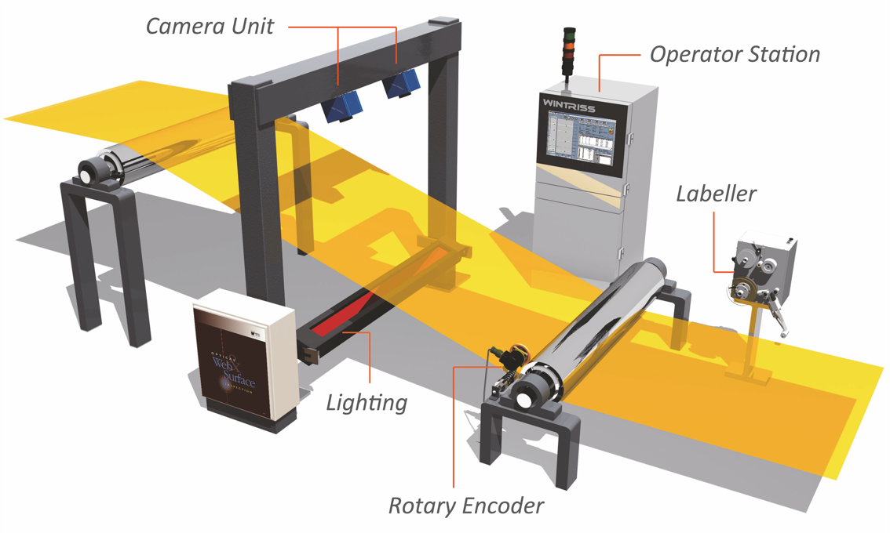
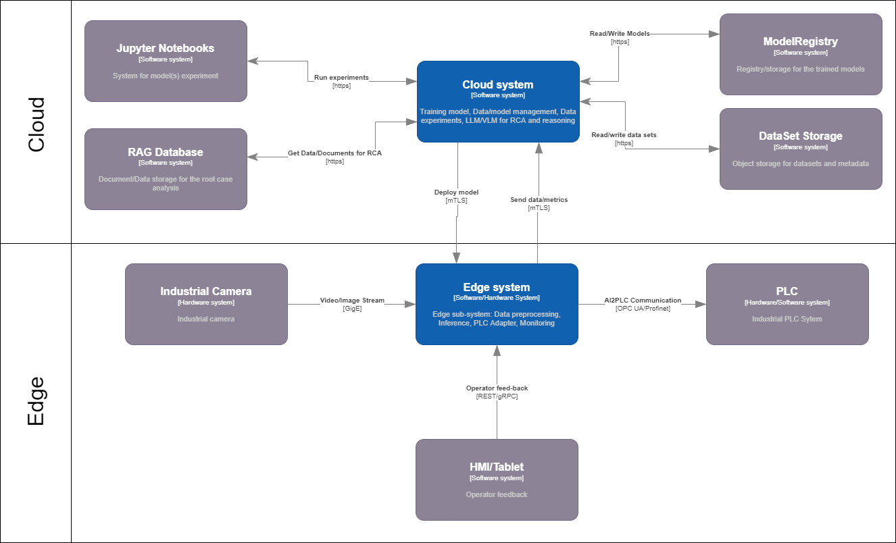

= Visual Quality Inspection — DDD Workshop Playbook
Dr. N. Golovko
:doctype: book
:icons: font
:source-highlighter: rouge
:toc: left
:toc-title: Contents
:toclevels: 3
:sectnums:
:sectnumlevels: 3
:partnums:
:chapter-label: Session

// ============================================================
//  PREAMBLE
// ============================================================

[.lead]
A complete facilitator's script for running seven Domain-Driven Design sessions that transform a broken industrial inspection system into a domain-driven architecture — from sticky notes on Day 1 to a deployable MVP scope and EU AI Act compliance framework on Day 2.

[NOTE]
====
This playbook is a *director's script*, not a summary.
Each session section describes what happens in the room, who says what, when the critical moments occur, and why each facilitation decision matters.
====

''''
== System Description — Business and Technical Context

=== The System in One Sentence
*The Visual Quality Inspection System (VQS)* system is an industrial AI application that detects surface defects on steel panels in real time at the production edge and uses cloud-based large language model analysis to identify the root causes of recurring defect patterns — with the goal of closing the feedback loop between human operator judgement and model improvement.

=== Business Context
The system operates on a steel panel production line (Line 3) at manufacturing facility. The line runs three shifts per day, seven days a week. At current throughput, the edge vision node inspects several thousand panels per shift.
*The core business problem* is defect escape: defective panels that pass through the inspection station undetected and are confirmed as defective only downstream — after further processing, packaging, or in the worst case, at the customer. The baseline defect escape rate entering this workshop is 12 escapes per 1,000 inspected units. The business goal is to reduce this to 8.4 or fewer — a 30% improvement — within six months of production deployment.
*Three organisational pressures drive the urgency.*
The first is quality cost. Every escaped defect represents rework, warranty exposure, or customer dissatisfaction. At current volumes, even a marginal reduction in escape rate has a measurable financial impact.
The second is regulatory obligation. The VQS system is classified as a high-risk AI system under the *EU AI Act.*
*This classification triggers obligations around data governance (Article 10), human oversight (Article 14), transparency (Article 13), and technical documentation (Article 12 and Annex IV). The system cannot legally operate in production without these obligations met. They are not optional features — they are go-live criteria.*
The third is operational fragility. The current system has no structured feedback path between operator behaviour and model improvement. When the model drifts — as it did during the lighting-change incident, producing 340 false positives over three days — the only discovery mechanism is an ML Engineer noticing an anomaly in a weekly report. This 72-hour gap is the primary operational risk the workshop is designed to close.

=== Technical Context
The VQS system operates across two distinct compute environments with different latency profiles, ownership models, and failure modes.

*The edge environment* runs on a fleet of vision nodes (EV-07) installed at the inspection stations on the production line. Each node captures four overlapping high-resolution frames per panel pass, runs an ML inference pipeline (YOLOv8-based, custom-trained on surface defect classes), and produces a defect classification with a confidence score within 140 milliseconds. The node is connected to the production line PLC, which triggers a physical diverter to route panels to scrap, rework, or pass lanes based on the assigned Decision. The node is also connected to an HMI workstation where the Quality Engineer receives alerts, reviews thumbnail images, and submits overrides. The edge environment is latency-critical and must operate correctly even during brief network interruptions with the cloud.

*The cloud environment* runs the Learning Loop — the set of services responsible for root cause analysis, model retraining, and data governance. These services are asynchronous: they are not in the critical path of the inspection decision and can tolerate higher latency. The cloud environment hosts an LLM/VLM-based root cause analysis pipeline, a case management system that tracks the lifecycle of inspection cases from intake through human-approved remediation, a model operations platform that manages versioned model artifacts and retraining pipelines, and a data and feature engineering layer that curates training datasets and maintains data lineage for EU AI Act compliance.

*The integration between the two environments* is mediated by a small set of domain events. The edge publishes InspectionCaseForwarded and DriftSignal events to the cloud. The cloud pushes new model artifacts and versioned DecisionBand configurations back to the edge fleet. This event-based boundary is deliberate: it decouples the real-time Decision Loop from the asynchronous Learning Loop and allows each to evolve independently.

*The LLM's role is strictly advisory.* The cloud RCA system uses a large language model to generate root cause hypotheses — plausible explanations for why a defect pattern is occurring, supported by evidence references from image batches and override logs. These hypotheses are never actioned directly. They are translated by an Anti-Corruption Layer inside the Case Management context into structured Recommendations, each of which requires explicit human approval from a Case Manager before any corrective action is taken. This architectural principle — keep the LLM advisory — is non-negotiable and is enforced at the integration boundary between the RCA and Case Management contexts.

*The current state before the workshop* is that none of these boundaries, patterns, or ownership rules are formally documented. The system has been built incrementally, with different teams owning different components without a shared language or explicit integration contracts. The EventStorming session makes this visible. The Bounded Context Canvas and Context Mapping sessions formalise it. The Example Mapping session resolves the business rule ambiguities that have been living in people's heads. The User Story Map and Impact Map translate the result into a prioritised delivery plan.

=== The Two Loops
The system architecture is built around two distinct processing loops that operate at different timescales and serve different purposes.

*The Decision Loop* runs at the edge, in real time. A panel arrives, the model fires, a Decision is assigned, the operator reviews, an Override may be submitted. This loop completes in under 30 seconds and is the primary mechanism by which the business goal — reducing defect escape rate — is achieved. It is entirely deterministic: given the same panel and the same active DecisionBand, the system will always produce the same Decision.

*The Learning Loop* runs in the cloud, asynchronously. Override patterns accumulate, a threshold is breached, a root cause analysis is triggered, a Recommendation is produced and approved, and eventually a new model version is trained and deployed back to the edge. This loop operates on a timescale of hours to weeks and is the mechanism by which the system improves over time. It is probabilistic: the LLM hypothesis may be correct or incorrect, the retraining may improve the model or degrade it, and human judgement is required at the approval gate to prevent automated propagation of errors.

*The central failure* of the current system is that *these two loops are not connected*. Overrides flow into the Decision Loop but do not reliably reach the Learning Loop. Drift occurs at the edge but is not detected in the cloud until a human happens to notice. Root cause analysis reports are generated but are not linked back to model updates. The workshop's primary structural contribution is to make this connection explicit, formally named, and owned.

== Workshop Overview

=== Purpose

The VQS system arrives at this workshop with three broken feedback loops, no shared language between teams, no documented ownership of critical decisions, and raw LLM output flowing directly into production databases.
The workshop produces: a shared language of 40+ terms, named ownership for every boundary, a mandatory Anti-Corruption Layer protecting the domain model from LLM noise, a documented governance process for model retraining, and an EU AI Act Article 10 compliance framework.
None of this requires writing a single line of code.

=== Schedule at a Glance

[cols="1,3,1,1", options="header"]
|===
| Session | Name | Day | Duration

| 1 | Domain Storytelling | Day 1 · 09:00 | 90 min
| 2 | EventStorming | Day 1 · 10:45 | 120 min
| 3 | Example Mapping | Day 1 · 14:00 | 60 min
| — | *Day 1 close · overnight preparation* | — | —
| 4 | Bounded Context Canvas | Day 2 · 09:00 | 90 min
| 5 | Context Mapping | Day 2 · 11:00 | 60 min
| 6 | User Story Mapping | Day 2 · 13:00 | 90 min
| 7 | Impact Mapping | Day 2 · 15:00 | 45 min
|===

*Total:* approximately 8.5 hours across two consecutive days.

=== Format Requirements

* In-person. Remote participation degrades the sticky-note phases significantly.
* Wall space: at least 6 metres of uninterrupted horizontal surface for the EventStorming paper roll.
* Two separate rooms or break-out corners: one for whole-group sessions, one for small-group Example Mapping.
* Consumables: orange, blue, yellow, red, green, and purple sticky notes; large-format paper roll; A3 canvas sheets; black and red markers; index cards; blue masking tape.

=== Participants and Roles

[cols="2,3,5", options="header"]
|===
| Name | Role | Workshop function

| Petra K.
| Quality Engineer
| Primary domain storyteller. The person whose lived experience drives Sessions 1–3. Must be present for all sessions.

| Sven M.
| ML Engineer
| Technical authority on model behaviour, drift, and retraining. Key participant from Session 2 onward.

| Jana R.
| Plant Manager
| Business goal owner. Holds approval authority for retraining and DecisionBand changes (RACI-v1). Essential for Sessions 1, 6, and 7.

| Tim B.
| Product Owner
| Owns acceptance criteria and scope decisions. Facilitates Example Mapping rule cards. Essential for Sessions 3, 6, and 7.

| Lukas D.
| Data Engineer
| Authority on training data, feature schemas, and DataLineage. Key participant for Sessions 2, 4, and 5.

| Dev Lead
| Architecture
| Makes integration pattern decisions in Session 5. Must be present for Sessions 4 and 5.

| Niki
| Facilitator
| Runs every session. Does not contribute domain knowledge. Draws on whiteboards, enforces time, parks debates, and writes the hotspot cards.
|===

=== The Three Broken Feedback Loops

These loops are identified in Session 1 and close progressively across the three releases.
Every session's work can be evaluated against whether it makes progress on closing them.

[cols="3,2,3", options="header"]
|===
| Loop | Current state | Target state

| Override → Drift Detection
| 72-hour lag. Manual weekly report review. No real-time signal.
| DriftSignal event published within 15 minutes of onset. Closes in Release 2.

| DriftDetected → ML Engineer awareness
| Ad hoc. Sven notices only if he reads the weekly report carefully.
| Automated DriftSignal alert to Model Operations. Closes in Release 2.

| RCA Report → Model Recalibration
| No automated path. No confirmed owner. No rollback mechanism.
| RACI-v1 governs manual retraining from MVP. Automated pipeline closes in Release 3.
|===

''''

// ============================================================
//  DAY 1
// ============================================================
[part]
= Day 1

''''

// ============================================================
//  SESSION 1
// ============================================================
== Domain Storytelling

*Day 1 · 09:00 · 90 minutes*

=== Goal

Capture the real workflow as told by the domain expert — no tech jargon, no org charts, no solutions.
One actor, one story at a time.
The session ends when the room has a shared picture of what actually happens on the shop floor, including what happens when things go wrong.

=== Who Is in the Room

[cols="3,5", options="header"]
|===
| Participant | Role in this session

| Petra K. | *Storyteller* — narrates both stories without interruption
| Jana R. | Listener — adds operational context after each story
| Tim B. | Listener — notes gaps between what Petra describes and what he assumed
| Facilitator | Draws stick-figure actor diagrams on the whiteboard as Petra speaks
|===

[IMPORTANT]
====
Sven (ML Engineer) and the Dev Lead are intentionally excluded from this session.
Technical people interrupt with implementation details.
The domain expert's story must come out unfiltered first.
Invite them for the debrief at minute 80 if needed, not before.
====

=== Physical Setup

Before participants arrive, the facilitator prepares:

* One large whiteboard cleared and accessible
* A stack of red sticky notes on the table for hotspot capture
* A stack of index cards for informal term collection
* No laptops visible — request devices face-down at the start

=== Minute-by-Minute Script

==== 0–10 min — Ground rules

The facilitator opens with the following instructions, spoken aloud:

[quote]
____
"We are writing a story today, not drawing a system diagram.
No laptops.
No 'but actually the system does it differently'.
Petra is going to talk and I am going to draw.
Your job is to listen and note anything that surprises you — write it on a red card and put it face-down in the middle of the table.
We will read those at the end."
____

The facilitator draws one stick figure on the whiteboard and labels it "Petra — Quality Engineer, Morning Shift."
Draws a second figure: "Panel on conveyor."
These two actors anchor the story.

==== 10–35 min — Story A: happy path

Petra narrates without interruption.
The facilitator draws each actor and action as she speaks — stick figures, arrows, simple labels in Petra's own words.
No domain jargon from the facilitator.
If Petra says "the blink", the facilitator writes "the blink" — not "HMI alert."

[NOTE]
====
*The facilitator's only questions during narration:*

* "Then what happened?"
* "Who did that?"
* "How long did that take?"

Never: "Does the system use a REST API or an event bus?"
====

The story Petra tells:

[cols="1,7", options="header"]
|===
| Step | What Petra says

| 1 | "A panel comes down on Conveyor 3. That's Line 3, morning shift."
| 2 | "The camera fires. Takes four pictures really fast."
| 3 | "If there's a scratch, the blink goes off — the red light on my screen."
| 4 | "I look at the little picture on my screen. It shows where the scratch is."
| 5 | "If I agree it's a scratch, I do nothing. The panel goes to scrap automatically."
| 6 | "If I think the model got it wrong, I press the override button."
| 7 | "Then it goes in the log. I move on to the next panel."
| 8 | "The whole thing takes me maybe 30 seconds if I agree. Longer if I override."
|===

The facilitator circles every decision on the drawing.
These become EventStorming seeds.

==== 35–40 min — Checkpoint

The facilitator reads the drawing back to Petra and asks: "Is that your story?"
Petra confirms or corrects.
The room notes any terms they wrote down that are not on the whiteboard.

==== 40–65 min — Story B: failure mode

The facilitator says:

[quote]
____
"Petra, tell me about a time it went wrong.
Not a small thing — a time where something broke and nobody knew for a while."
____

Petra narrates the lighting-change incident:

[cols="1,7", options="header"]
|===
| Step | What Petra says

| 1 | "At the 2 o'clock handover they changed the lighting on Line 3. LED instead of halogen. Maintenance job."
| 2 | "Nobody told us. Nobody told Sven."
| 3 | "The model started flagging almost every panel as a scratch. It was wrong — the LED changes how the surface looks."
| 4 | "I started overriding. One by one. Every panel."
| 5 | "By the next day I had done hundreds of overrides. My notes just said 'visual check OK'."
| 6 | "I told the shift lead on day two. He thought it was a bad batch of steel."
| 7 | "Three days later Sven saw something funny in the weekly report and figured it out."
| 8 | "He fixed the model. But those 340 panels I passed — nobody went back to check them properly."
|===

When Petra says "three days later Sven saw something funny in the weekly report", the facilitator draws a large gap on the whiteboard between "Override" and "ML Engineer aware."
Labels it: *72-hour gap — no one alerted.*

==== 65–80 min — Reactions and additions

Jana: "I see the escape rate report weekly. I had no idea this was happening."

Tim: "I didn't know there was an override log. I assumed if she overrode, it went somewhere useful."

The facilitator writes both facts on red cards.
Does not comment on them.
Parks them.

==== 80–90 min — Hotspot collection and term harvest

The facilitator reads every red card aloud and numbers them H1 through H7.
Then asks: "What informal words did you hear Petra use that we should write down?"

[cols="3,6", options="header"]
|===
| Term heard | What it likely means

| "the blink" | Red warning light flash at the HMI when a defect is detected
| "a false" | A false positive — incorrect SCRAP decision by the model
| "ghost scratch" | A scratch the model detects that does not physically exist — often a lighting artefact
| "the override button" | The confirmation action on the HMI panel that logs a correction
| "a bad batch" | Shift lead assumption: product quality issue, not a model issue
| "the weekly" | Weekly override rate report reviewed by the ML Engineer
| "lighting flip" | The informal name for the halogen-to-LED transition
| "drift window" | The undetected period between model drift onset and discovery
|===

=== Artefacts Produced

[cols="3,6", options="header"]
|===
| Artefact | Description

| Story A — happy path
| 8-step narrative on whiteboard, actor–activity diagram drawn in real time. Photographed at session close.

| Story B — failure mode
| The lighting-change incident: 8 steps, 72-hour gap drawn explicitly, 3 broken feedback loops visible.

| 8 informal terms
| Ubiquitous language candidates on index cards, ready for the EventStorming glossary.

| 7 red hotspot cards
| H1–H7: unresolved surprises on red stickies, pinned to the wall for Session 2.
|===

=== Critical Facilitation Move

[WARNING]
====
When Petra says "the model was wrong for three days and nobody knew", the room will want to solve it immediately.
Do not allow this.

Write "72h gap: Override → ML Engineer awareness" as hotspot H3 and say:

_"We will solve this in Session 3. Not now."_

Holding the tension is what makes Example Mapping productive.
If the room solves problems in the storytelling session, Example Mapping has nothing to work on.
====

=== Carry Forward to Session 2

[cols="6,2", options="header"]
|===
| Output | Status

| 7 hotspot cards (physical red stickies) | ✅ done
| 8 informal terms on index cards | ✅ done
| Actor list: 5 actors identified | ✅ done
| 3 broken feedback loops named and drawn | ✅ done
| 12 domain concept candidates listed | ✅ done
|===

''''
[NOTE]
link:step1_domain_storytelling.adoc[Template for the Domain Story Telling and Filled up Example for the VQS]

// ============================================================
//  SESSION 2
// ============================================================
== EventStorming

*Day 1 · 10:45 · 120 minutes*

=== Goal

Map the full domain lifecycle on a timeline using colour-coded sticky notes.
Confirm the seven hotspots from Session 1.
Identify the natural boundaries of five emerging bounded contexts.
Photograph the wall.

=== Who Is in the Room

[cols="3,5", options="header"]
|===
| Participant | Role in this session

| Petra K. | Domain events for the Decision Loop
| Sven M. | Domain events for the Learning Loop — joins the full group from here
| Tim B. | Policies and hotspot clarification
| Lukas D. | Data and feature events — joins from here
| Facilitator | Enforces time phases, draws context boundaries, writes red cards
|===

=== Physical Setup

Before participants arrive, the facilitator prepares:

* 6-metre paper roll taped horizontally to the wall at chest height
* At the left end: index card reading "Panel arrives on conveyor"
* At the right end: index card reading "Model deployed to edge"
* The 7 red hotspot cards from Session 1 pinned below the timeline, visible to all
* Six stacks of sticky notes at the table: orange, blue, yellow, red, green, purple
* Sticky note legend posted on the side wall (see below)

==== Sticky Note Legend

[cols="2,3,4", options="header"]
|===
| Colour | Type | Rule

| 🟧 Orange | Domain event | Past tense. A fact that happened. "DefectDetected."
| 🟦 Blue | Command | Imperative. An intention that causes an event. "AssignDecision."
| 🟨 Yellow | Aggregate | Noun. The thing that handles commands and emits events. "InspectionCase."
| 🟩 Green | Policy | "Whenever [event], then [command]."
| 🟥 Red | Hotspot | Unresolved question, conflict, or gap. Park and move on.
| 🟪 Purple | External system | A system outside your domain boundary.
|===

=== Minute-by-Minute Script

==== 0–5 min — Rules

The facilitator reads the legend aloud and adds:

[quote]
____
"Orange stickies only for the first 25 minutes.
No debate about which colour — write first, discuss later.
If you think of a command or a question while placing events, write it on a blue or red card and set it on the table — we will place it later.
Go."
____

==== 5–30 min — Silent event phase

Everyone writes orange events simultaneously and places them on the timeline.
The wall fills fast.

Key events placed and by whom:

[cols="4,3,4", options="header"]
|===
| Event | Placed by | Notes

| DefectDetected | Sven | First orange card on the wall
| OverrideSubmitted | Petra | She places it immediately after HMIAlertFired
| DriftDetected | Sven | He pauses before placing this — "this doesn't really happen reliably today"
| RootCauseSuggested | Sven | Places it far to the right — it is async, it floats
| ModelDeployed | Lukas | Last event placed — closes the Learning Loop
|===

When Tim asks "what causes DriftDetected?", the facilitator says:
_"Red card. We will answer that in Session 3."_

==== 30–50 min — Timeline ordering

The group walks left to right, placing events in sequence.

First conflict: where does "RootCauseSuggested" sit relative to "CaseClosed"?
Sven: "It comes later — it is asynchronous. The case can close before RCA even starts."

This is the moment the two-loop architecture becomes visible for the first time.
The facilitator draws a horizontal line separating the timeline into two tracks:

* *Upper track:* Decision Loop — Inspection edge, real time
* *Lower track:* Learning Loop — cloud, async

The room reacts. Petra: "So when I override, that eventually feeds back into the model? Through this bottom track?"
The facilitator confirms and draws the three broken feedback loops as dashed arrows on the paper roll.
The room sees them simultaneously for the first time.

==== 50–75 min — Commands, aggregates, policies

The facilitator calls: "Blue stickies. Commands only."
Then: "Yellow stickies. Aggregates."
Then: "Green stickies. Policies — Whenever X, then Y."

The policy that produces the most debate:

Green card written by Tim: "IF DriftDetected THEN alert ML Engineer."

Jana: "Who decides to retrain?"
Sven: "Usually me — but I should ask you first."
Jana: "Nobody has ever asked me."

The facilitator writes hotspot H6 on a red card: *"Retraining decision ownership — nobody owns this."*
Places it on the paper roll at the position of DriftDetected.
This is the most important sticky note of the day.

[IMPORTANT]
====
Do not let anyone answer H6 in this session.
The organisational question of who owns the retraining decision cannot be resolved by the people in this room without authority.
It must be escalated to Jana and Tim as a pre-session assignment for Day 2.
Say: _"H6 is a governance question, not a design question. Tim and Jana need to answer it tonight so we can draw the Model Operations canvas tomorrow."_
====

==== 75–100 min — Context boundaries

The facilitator asks: "Which events naturally belong together? Walk to the wall and draw a pencil line around them."

Five clusters form organically:

[cols="3,5", options="header"]
|===
| Context cluster | Events inside

| Inspection (Edge) | PanelArrived through InspectionCaseForwarded — the real-time Decision Loop
| RCA (Cloud) | RCARequested, AnalysisJobStarted, RootCauseSuggested — the async analysis step
| Case Management (Cloud) | CaseOpened through CaseClosed — the lifecycle and audit layer
| Model Operations (Cloud) | DriftDetected through ModelDeployed — the drift and retrain pipeline
| Data / Feature (Cloud) | TrainingDataset events — the data governance layer
|===

==== 100–120 min — Hotspot prioritisation

The facilitator reads every red card aloud and asks the group to rank them for Session 3.

Priority order agreed:

[cols="1,6,2", options="header"]
|===
| # | Hotspot | Priority

| H4 | Override reason codes do not exist — blocks EU AI Act compliance and retraining pipeline | Resolve first
| H1 | When does Override trigger RCA? — most room disagreement | Resolve second
| H3 | DecisionBand thresholds have no owner, version, or review cadence | Resolve third
| H5 | No Anti-Corruption Layer between RCA and Case Management | Resolve fourth
| H2 | DriftDetected has 72-hour lag | Resolve in Step 4 canvas
| H6 | Retraining decision ownership — RACI required | Resolve overnight (Tim + Jana)
| H7 | Model retraining is entirely manual | Resolve in Step 4 canvas
|===

The facilitator photographs the wall.

=== Artefacts Produced

[cols="3,6", options="header"]
|===
| Artefact | Description

| Full event timeline on paper roll
| 22 domain events across two tracks (Decision Loop / Learning Loop). Photographed.

| 7 hotspots prioritised
| H1–H7 on red cards, ranked and pinned to the wall in priority order.

| 5 bounded context clusters
| Pencil boundaries drawn on the paper roll around natural event groups.

| 4 policy cards
| Green "Whenever X, then Y" cards linking events to responses.

| Two-loop architecture diagram
| Decision Loop (upper track) and Learning Loop (lower track) drawn and labelled.
|===

=== Critical Facilitation Move

[WARNING]
====
When the silence falls after "who decides when to retrain the model?", let it last.
Count to five before speaking.
Then write H6 on a red card and say:
_"That silence is the most important thing that has happened in this workshop so far. It means the organisation has a governance gap. We will close it tonight."_

The silence itself is diagnostic.
Resolving it prematurely — by letting Sven say "I usually decide" — would close the conversation too early and prevent the RACI from being formalised.
====

=== Overnight Assignments Before Day 2

Two items must be resolved before Session 4.
Assign at the close of Session 2, confirm at the start of Day 2.

[cols="3,5,3", options="header"]
|===
| Item | Question to answer | Assigned to

| H6 — Retraining RACI
| Who authors the RetrainingJob specification? Who approves it? Who executes? Who can veto on timing?
| Tim B. + Jana R.

| AC-08 — Duplicate RCA job
| When the override threshold is breached for a DefectType that already has an open RCA job, do we append evidence to the existing job or open a new one?
| Tim B.
|===

=== Carry Forward to Session 3

[cols="6,2", options="header"]
|===
| Output | Status

| Hotspot priority list: H4 first, H1 second, H3 third, H5 fourth | ✅ done
| 22 events photographed and ready for digital transfer | ✅ done
| 5 context cluster names agreed | ✅ done
| H6 and AC-08 assigned for overnight resolution | ✅ done
|===

[NOTE]
link:step2_eventstorming.adoc[Template for the Event Storming and filled up Example for the VQS]

// ============================================================
//  SESSION 3
// ============================================================
== Example Mapping

*Day 1 · 14:00 · 60 minutes*

=== Goal

Resolve ambiguity in the four highest-priority hotspots using concrete examples.
One rule per fifteen minutes.
Produce twelve acceptance criteria and eight new domain concepts.

=== Who Is in the Room

[cols="3,5", options="header"]
|===
| Participant | Role in this session

| Petra K. | Provides operational examples from the shop floor
| Sven M. | Provides technical counter-examples from model behaviour
| Tim B. | Writes rule cards, owns acceptance criteria
| Dev Lead | Provides architectural constraints — joins from Session 3
|===

=== Physical Setup

* A small table with four chairs — not the full group
* Four stacks of index cards: yellow (rules), green (examples), red (questions), blue (new concepts)
* One timer visible to all

=== Minute-by-Minute Script

==== 0–15 min — H4: Override reason codes

Tim writes the rule card (yellow):

[quote]
____
"Override requires a ReasonCode from a controlled vocabulary.
Free-text justification is not accepted."
____

Petra's reaction: "I didn't know that was possible. Can I actually pick from a list?"

Sven's reaction: "The free-text notes are useless for retraining. I've never been able to use them."

Tim's reaction: "I didn't know the override log existed."

Three confirming examples placed (green).
Counter-example 1 (green): Petra selects RC-07 ('other') with a casual note.
The room debates: is RC-07 acceptable?
Agreement: yes, but only with mandatory free-text of at least ten characters, and it sets an EscalationFlag on the Case.
*New concept discovered:* EscalationFlag.

Counter-example 2: an incorrect override (Petra was wrong).
*New concept discovered:* FalseOverride.

One open question (red): can Quality Engineers propose new reason codes in the field?
Parked.

==== 15–35 min — H1: Override pattern triggers RCA

Tim writes the rule card (yellow):

[quote]
____
"Three or more Overrides of the same DefectType with model-error ReasonCategory within a rolling 24-hour window triggers RCARequested."
____

This rule did not exist before the session.
It took 20 minutes of debate to reach.

Key moment: Sven says "any override should trigger RCA."
Petra says "only if it keeps happening."
Tim: "What is 'keeps happening'? Three? Five? A shift? A day?"
Facilitator: "These are green cards — give me a concrete example for each answer."

The examples resolve it: three overrides of the same DefectType within a rolling 24 hours.

*Critical counter-example:* five overrides of 'SurfaceScratch' with RC-01 ('material variation') within one hour.
Sven: "That should not trigger RCA — material variation is expected."
This is the most important single insight of the session.
The trigger is DefectType plus ReasonCategory — not raw override count.
*New concept confirmed:* ReasonCategory (model-error vs material-variation).

*New concept discovered:* OverrideWindow (rolling 24 hours per DefectType — not shift-aligned).

==== 35–50 min — H3: DecisionBand governance

Facilitator asks Jana (brought in for this rule only): "When did you last review the decision band thresholds?"

Jana: "I didn't know I was supposed to."
Sven: "I set them 14 months ago. I haven't touched them."

Rule agreed immediately: every DecisionBand must be versioned (DBV) with an owner role, approval record, and review date.

Counter-example surfaces a gap: what if an operator needs to adjust thresholds during an emergency like the lighting change?
Resolution: TemporaryBandOverride concept — an emergency adjustment requiring the same approvals as a DBV but bypassing the full versioning cycle.
*New concept discovered:* DecisionBandVersion (DBV) and TemporaryBandOverride.

==== 50–60 min — H5: Anti-Corruption Layer

Dev Lead: "Currently we pass the raw LLM JSON into the case management database."

The room goes quiet.

Sven: "The LLM is wrong sometimes. We've seen it hallucinate cause categories."

Dev Lead: "So we need a translation layer."

Facilitator writes the rule card:

[quote]
____
"RootCauseHypothesis must never be stored in Case Management.
The ACL translates it into a Recommendation with a ConfidenceBucket and a human approval gate."
____

Counter-example: the hypothesis cannot be mapped to any known cause category.
*New concept discovered:* CauseVocabularyGap.

=== Artefacts Produced

[cols="3,6", options="header"]
|===
| Artefact | Description

| 4 rule cards (yellow)
| H4, H1, H3, H5 — each with a precise agreed rule statement written by Tim.

| 12 example cards (green)
| 3 confirming examples plus 2 counter-examples per rule. Given/Then format.

| 8 new domain concepts (blue)
| ReasonCode · ReasonCodeVocabulary · ReasonCategory · OverrideWindow · DecisionBandVersion · TemporaryBandOverride · ConfidenceBucket · CauseVocabularyGap.

| 14 acceptance criteria (orange)
| AC-01 through AC-14. 12 agreed, 2 pending (AC-08 — duplicate RCA job; AC-14 — CauseVocabularyGap SLA).
|===

=== What This Session Proves

[NOTE]
====
Every abstract rule that "everyone understood" contained at least one hidden contradiction.
Example Mapping surfaces them in fifteen minutes by forcing concrete scenarios.

The most valuable output is not the agreed rules.
It is the counter-examples that break them.

Specifically: the discovery that RC-01 (material variation) must not trigger RCA is the most important single insight of the day.
Without it, the override threshold rule would have been wrong and the system would have flooded the RCA pipeline with noise.
====

=== Boundary Decisions for Session 4

The following placement decisions were reached during Session 3 and are ready to be placed on the canvases without further debate:

[cols="5,5", options="header"]
|===
| Decision | Source

| ReasonCode lives in both Inspection (capture) and Case Management (storage and analysis) | H4 counter-example 1
| ReasonCodeVocabulary is owned by Case Management | H4 rule card
| OverrideWindow is a Case Management concept — invisible to Inspection | H1 rule card
| ACL lives inside Case Management, not in RCA | H5 rule card
| DecisionBandVersion is owned by Model Operations, referenced by Inspection | H3 counter-example 1
| ConfidenceBucket is a Case Management term — never appears in RCA or Inspection | H5 counter-example 1
|===

=== Carry Forward to Session 4

[cols="6,2", options="header"]
|===
| Output | Status

| 8 new concepts added to ubiquitous language | ✅ done
| 14 acceptance criteria written | ✅ done
| 6 boundary placement decisions ready | ✅ done
| AC-08 and AC-14 marked as blockers for Case Management canvas design | ✅ done
|===

[NOTE]
link:step3_example_mapping.adoc[Example Mapping Template and Filled up example for VQS]

// ============================================================
//  DAY 2
// ============================================================
[part]
= Day 2

''''

// ============================================================
//  SESSION 4
// ============================================================
== Bounded Context Canvas

*Day 2 · 09:00 · 90 minutes*

=== Goal

Fill five A3 canvas sheets — one per bounded context — with strategic classification, purpose, capabilities, ubiquitous language, dependencies, owned domain events, EU AI Act obligations, and open questions.
Start with Inspection because it is the Core Domain and every other decision depends on it.

=== Who Is in the Room

[cols="3,5", options="header"]
|===
| Participant | Role in this session

| Petra K. | Validates Inspection canvas language and capabilities
| Sven M. | Authors RCA and Model Operations canvases
| Tim B. | Validates purpose statements and owns open questions
| Dev Lead | Reviews dependency patterns and integration contracts
| Lukas D. | Authors Data/Feature canvas
|===

=== Pre-Session: Confirm Overnight Resolutions

The facilitator opens Day 2 with a three-minute confirmation:

*H6 — Retraining RACI (must be confirmed before proceeding):*

[cols="3,5", options="header"]
|===
| RACI role | Person

| Author (creates RetrainingJob specification and presents evidence) | Sven M. (ML Engineer)
| Approver (must approve before any retraining begins) | Jana R. (Plant Manager)
| Veto on timing | Tim B. (Product Owner)
| Executor (runs the pipeline) | MLOps Platform Team
|===

This is recorded as RACI-v1 and referenced in the Model Operations outbound contract to Inspection.

*AC-08 — Duplicate RCA job (must be confirmed before proceeding):*

Decision: a new threshold breach for a DefectType with an open AnalysisJob appends evidence to the existing job rather than opening a duplicate.
The RCARequested event schema is updated to v1.1 to include a `job_id` field for deduplication.

=== Minute-by-Minute Script

==== 0–18 min — Canvas 1: Inspection

Fast agreement. The Core Domain classification is uncontested.

Key decisions:

* TemporaryBandOverride lives in Inspection (runtime enforcement), not Model Operations (governance).
* FalseOverride event lives in Case Management, not Inspection — it is discovered through RCA feedback, not at override time.
* ConfidenceScore is included in the outbound payload for audit purposes but is never displayed directly to the operator on the HMI.

==== 18–36 min — Canvas 2: RCA

Supporting subdomain. Fast agreement.

Key decision: RCA receives pre-processed DefectPatterns from Case Management, not raw Override logs.
RCA must not depend on Case Management's internal structure.
Case Management packages the pattern before publishing.

==== 36–54 min — Canvas 3: Case Management

Heaviest canvas. Eight capabilities. Four EU AI Act obligations.

Key debate: does ReasonCodeVocabulary live in Case Management or Data/Feature?

Lukas argues Data/Feature should own it for label taxonomy alignment.
Tim argues it is tightly coupled to Override validation logic.
Decision: Case Management. Data/Feature consumes it as a read-only lookup table.

Dev Lead confirms: implementing the ACL correctly is a two-sprint investment.
The room accepts this. Tim: "If we skip the ACL, we will have LLM nonsense in the production database within a month."

AC-08 and AC-14 remain as open questions on the canvas — they affect the Case aggregate state machine and must be resolved before sprint 1 planning.

==== 54–72 min — Canvas 4: Model Operations

H6 RACI confirmed at session open.
Canvas fills quickly.
TemporaryBandOverride approval workflow placed here — it governs the exception, Inspection enforces it.

Open questions entering Session 5: H7 (automated vs manual retraining trigger) and whether DriftSignal needs an environmental context extension once sensor infrastructure is available.

==== 72–90 min — Canvas 5: Data / Feature

Generic subdomain — the group agrees to evaluate buying pipeline tooling before building it.

Key EU AI Act point: DataLineage tracking per TrainingDataset is the Article 10 data governance mechanism.
Every RetrainingJob must carry a `lineage_record_id` before Model Operations accepts it.

SyntheticSample generation scope deferred to an architecture review — may become a separate GenAI context.

=== Artefacts Produced

[cols="3,6", options="header"]
|===
| Artefact | Description

| 5 filled A3 canvas sheets
| One per context. Photographed and transferred to digital form after the session.

| Dependency overview table
| A 5×5 matrix showing all integration boundaries with pattern names — reviewed and confirmed by Dev Lead.

| 40+ ubiquitous language terms
| Defined per context. Cross-context homonyms (e.g. "Decision" means different things in Inspection and Case Management) explicitly flagged.

| 8-item open questions tracker
| Remaining unresolved items with assigned owner and carry-forward flag.
|===

=== Critical Facilitation Move

[WARNING]
====
The Case Management canvas will generate the most debate.
When the ACL discussion stalls on implementation complexity, redirect with:

_"The question is not how hard it is to build.
The question is what happens if we don't build it.
Raw LLM output in your domain model means your Case aggregate depends on whatever the LLM decides to produce today.
That changes without notice.
The ACL protects you from that."_

This usually ends the debate.
====

=== Carry Forward to Session 5

[cols="6,2", options="header"]
|===
| Output | Status

| 5 canvases digitised and shared with Dev Lead | ✅ done
| 6 integration boundaries named in the dependency table | ✅ done
| RACI-v1 confirmed and documented | ✅ done
| ACL contract stub for RCA → Case Management ready to formalise | ✅ done
|===

[NOTE]
link:step4_bounded_context_canvas.adoc[Bounded Context Canvas Template and filled up example for the VQS]

// ============================================================
//  SESSION 5
// ============================================================
== Context Mapping

*Day 2 · 11:00 · 60 minutes*

=== Goal

Name every integration relationship between bounded contexts with a formal pattern.
Agree who changes when the other changes.
Formalise the ACL contract stub.
Mark every EU AI Act traceability boundary.

=== Who Is in the Room

[cols="3,5", options="header"]
|===
| Participant | Role in this session

| Sven M. | Validates RCA and Model Operations boundary patterns
| Tim B. | Approves contract ownership decisions
| Dev Lead | *Primary voice for this session* — makes integration pattern decisions
| Lukas D. | Validates Data/Feature outbound contracts
| Facilitator | Draws the context map on the whiteboard, labels each arrow as the group agrees
|===

=== Physical Setup

The facilitator draws five labelled boxes on the whiteboard before the session:

----
[ Inspection ]   [ RCA ]   [ Case Mgmt ]   [ Model Ops ]   [ Data/Feature ]
----

Six unlabelled arrows are drawn between them.
The group's job is to label every arrow with a pattern name and answer: "Who changes when the other changes?"

=== Minute-by-Minute Script

==== 0–10 min — Pattern reference

The facilitator reviews the six integration patterns on a card:

[cols="2,4,2", options="header"]
|===
| Pattern | When to use | Risk

| Customer-Supplier | Clear upstream/downstream. Upstream dictates. | Medium
| Anti-Corruption Layer | Downstream translates and protects itself from upstream. | Low
| Open Host Service | Upstream publishes a stable versioned API for multiple consumers. | Low
| Published Language | Agreed shared event schema. Neither side owns the other's model. | Low
| Conformist | Downstream adopts upstream's model without translation. | High
| Partnership | Both teams coordinate in lockstep. | Very high
|===

==== 10–30 min — Four arrows labelled quickly

The following four boundaries are agreed without significant debate:

[cols="4,3,4", options="header"]
|===
| Boundary | Pattern | Who adapts

| Inspection → Case Management | Customer-Supplier | Case Management adapts when InspectionCase schema changes
| Case Management → RCA | Customer-Supplier | RCA adapts when RCARequested schema changes
| Model Operations → Inspection | Customer-Supplier | Inspection adapts when ModelArtifact format changes
| Data/Feature → Model Operations | Customer-Supplier | Model Operations adapts when TrainingDataset schema changes
|===

==== 30–50 min — The contested arrow: RCA → Case Management

Dev Lead: "Just call the API. Case Management calls the RCA endpoint and gets the JSON back."

Sven: "The LLM is wrong sometimes. It hallucinates cause categories. Case Management cannot trust it."

Dev Lead: "So we add a validation layer."

Facilitator: "That validation layer has a name. It is called an Anti-Corruption Layer." Writes "ACL" on the arrow.

Explains: the ACL lives inside Case Management. RCA publishes via Open Host Service. Case Management's ACL translates RootCauseHypothesis → Recommendation with ConfidenceBucket. Raw LLM output is never stored in Case Management's domain model.

Dev Lead: "That is two sprints of work."

Tim: "What is the cost of not doing it?"

Silence.

Tim: "We proceed with the ACL."

[cols="3,3,4", options="header"]
|===
| RCA (OHS) term | Case Management term | Translation rule

| hypothesis_text | (discarded) | Never stored. Case Management never holds raw LLM text.
| llm_confidence | ConfidenceBucket | ≥0.80 = High. 0.50–0.79 = Medium. <0.50 = Low.
| cause_category | Recommendation.cause_category | Direct if category exists in ACL vocabulary. Null → CauseVocabularyGap raised.
| evidence_refs[] | Recommendation.evidence_summary | Stored as opaque reference list.
| analysis_job_id | Recommendation.rca_job_ref | Stored verbatim for Article 10 traceability.
|===

==== 50–60 min — EU AI Act traceability boundaries

The facilitator marks four boundaries in a different colour on the whiteboard:

[cols="3,5,2", options="header"]
|===
| Boundary | Obligation | Article

| Inspection → Case Management | Every InspectionCaseForwarded event must carry ReasonCode, RCV version, DBV version, model version, and operator ID | Article 10, 14
| RCA → Case Management (ACL) | analysis_job_id in every Recommendation links the human-approved action to the LLM evidence | Article 10, 13
| Model Operations → Inspection | production_lot_id in every ModelArtifact push enables post-hoc traceability to the exact model version | Article 10, 12
| Data/Feature → Model Operations | lineage_record_id in every TrainingDataset delivery constitutes data provenance documentation | Article 10, Annex IV
|===

=== Artefacts Produced

[cols="3,6", options="header"]
|===
| Artefact | Description

| Annotated context map
| 6 boundaries, each labelled with pattern name, contract version, and change ownership.

| ACL contract stub
| Full translation table with 4 validation rules and explicit rejection criteria.

| EU AI Act boundary register
| 4 boundaries with Article references and obligations — referenced in the technical documentation.

| Context map narrative
| Written summary: why Case Management is the integration hub, why the ACL is non-negotiable.
|===

=== Critical Facilitation Move

[WARNING]
====
"Just pass the JSON" is always the developer's first instinct when the upstream source is an LLM.
It is always wrong.

Document the reasoning for the ACL in the context map narrative explicitly:

_The ACL protects Case Management from LLM non-determinism.
Without it, the Case aggregate's behaviour depends on whatever the model produces on a given day.
The ACL makes Case Management's domain model stable regardless of what RCA publishes._

This reasoning will be challenged again in sprint planning.
Having it written in the context map gives the team a document to point to.
====

=== Carry Forward to Session 6

[cols="6,2", options="header"]
|===
| Output | Status

| Context map with 6 named boundaries | ✅ done
| ACL translation rules formalised | ✅ done
| 4 EU AI Act traceability boundaries documented | ✅ done
| DriftSignal: Published Language pattern confirmed — observation, not command | ✅ done
|===

[NOTE]
link:step5_context_mapping.adoc[Context Mapping Template and filled up example for the VQS]

// ============================================================
//  SESSION 6
// ============================================================
== User Story Mapping

*Day 2 · 13:00 · 90 minutes*

=== Goal

Align development priorities with real user workflow.
Define the MVP slice.
Make scope trade-offs explicit and visible.
Ensure EU AI Act audit trail stories appear in MVP, not a later release.

=== Who Is in the Room

[cols="3,5", options="header"]
|===
| Participant | Role in this session

| Tim B. | Facilitates story placement and owns the release line decision
| Petra K. | Validates stories for the Review backbone step
| Sven M. | Advocates for Learning Loop stories
| Jana R. | Advocates for Plant Manager visibility stories
| Dev Lead | Estimates feasibility for release prioritisation
|===

=== Backbone Steps

[cols="1,3,5", options="header"]
|===
| # | Step | Description

| 1 | Detect | Edge model runs inference on a production unit in real time
| 2 | Assign | Decision auto-assigned from active versioned DecisionBand
| 3 | Review | Quality Engineer reviews HMI alert and confirms or overrides
| 4 | Investigate | Override pattern triggers RCA; hypothesis produced and translated
| 5 | Approve | Case Manager reviews Recommendation; human approval gate
| 6 | Retrain | Drift confirmed; retraining pipeline initiated with Plant Manager approval
|===

[NOTE]
====
Approve (step 5) was missing from the original plan.
Jana identified the gap when she asked "where does approving the recommendation go?"
It was added as a backbone step during the session.
This is expected — the backbone always needs at least one correction from a stakeholder who was not in Sessions 1–3.
====

=== Minute-by-Minute Script

==== 0–20 min — Backbone walk

Tim writes the six backbone steps on large cards and tapes them to the wall.
The group walks left to right and confirms the order.
No stories placed yet.

==== 20–55 min — Story placement

The group places story cards below each backbone step.

Contested story: real-time DriftSignal alert in MVP.

Sven: "I need to know within two hours, not 72 hours."

Jana: "But Sven reads the weekly report and that works for now."

Sven: "It didn't work in the lighting-change incident."

Facilitator: "Place it above or below the line based on this question: is real-time drift detection required to achieve the 30% escape rate reduction in six months?
If yes, above.
If not required to hit that goal in that timeframe, below."

Group discussion.
Decision: below the line. The six-month goal can be met with manual triage supported by structured override data.
Real-time DriftSignal alert moves to Release 2.

==== 55–75 min — EU AI Act stories

Tim places "immutable audit log" below the release line.

Facilitator: "That is a legal requirement for operating a high-risk AI system under EU AI Act.
It cannot be below the line.
The system cannot go to production without it."

Tim moves it above the line.
All five EU AI Act stories confirmed as MVP.

==== 75–90 min — Cut list

Jana: "I want the Plant Manager dashboard in MVP."

Tim: "The AuditLog export API gives you the same data in CSV. We can build the dashboard in Release 3."

Jana: "Can I actually get what I need from the CSV?"

Tim: "Yes — escape rate per 1,000 units, override rate per DefectType, weekly. I'll show you a mock-up."

Jana accepts. Dashboard moves to Release 3.

Five items documented in the cut list with rationale agreed by the room:

[cols="4,5", options="header"]
|===
| Item cut from MVP | Rationale

| Automated retraining pipeline (R3)
| No actor needs automated retraining to achieve the 30% goal in 6 months. RACI-v1 manual-trigger is sufficient.

| Plant Manager shift dashboard (R3)
| AuditLog export API provides equivalent data in MVP. Dashboard is a UX improvement, not a behaviour change.

| Environmental context logging (R3)
| Sensor infrastructure for lighting and temperature is not available at MVP timeline.

| Synthetic data generation (R3)
| DataGap detection is sufficient for MVP. SyntheticSample generation is a six-sprint investment.

| Override rate trend visualisation (R2)
| ML Engineer can access raw AuditLog data in MVP. Visualisation is a Release 2 quality-of-life improvement.
|===

=== Artefacts Produced

[cols="3,6", options="header"]
|===
| Artefact | Description

| User story map
| 6-step backbone, 3 release swimlanes, 8 MVP + 6 R2 + 5 R3 stories. Photographed.

| 5 EU AI Act stories (EU-01 through EU-05)
| All confirmed in MVP slice.

| 6 non-functional stories (NF-01 through NF-06)
| Latency, audit tamper-proof, at-least-once delivery, RCV versioning — all placed in MVP or R2.

| 5-item cut list
| Each item with documented rationale agreed by Tim and Jana.
|===

=== Carry Forward to Session 7

[cols="6,2", options="header"]
|===
| Output | Status

| MVP scope: 8 user + 5 EU + 4 NF stories | ✅ done
| Release 2 and Release 3 backlogs defined | ✅ done
| Cut list with rationale documented | ✅ done
| Backbone steps confirmed | ✅ done
|===

[NOTE]
link:step6_user_story_mapping.adoc[User Story Mapping Template and filled up example for the VQS]

// ============================================================
//  SESSION 7
// ============================================================
== Impact Mapping

*Day 2 · 15:00 · 45 minutes*

=== Goal

Connect every deliverable to a measurable business goal.
Cut anything without a path to the goal.
Produce a prioritised deliverable list and a success metric per actor.

=== Who Is in the Room

[cols="3,5", options="header"]
|===
| Participant | Role in this session

| Tim B. | Facilitates actor branch construction
| Jana R. | *Goal owner* — states and agrees the business goal
| Petra K. | Validates Quality Engineer impacts
| Sven M. | Validates ML Engineer impacts
|===

=== The Business Goal

[cols="2,5", options="header"]
|===
| Field | Value

| Goal statement
| Reduce the defect escape rate on Line 3 by 30% within six months of production deployment.

| Current baseline
| 12 defect escapes per 1,000 inspected units (Q1 2026 average, Line 3)

| Target
| ≤ 8.4 defect escapes per 1,000 inspected units

| Measurement method
| Weekly defect escape log. An escape is a defective unit confirmed downstream of the inspection station.

| Goal owner
| Jana R. (Plant Manager)
|===

[NOTE]
====
This is the first time the goal has been written down in the room.
Jana has been running toward it implicitly for months.
Writing it, with a number and a timeframe, changes the conversation for the rest of the session.
When any deliverable is questioned, the question becomes: "Does this directly contribute to this goal in this timeframe?"
That is the most useful question in the workshop.
====

=== Actor Branches

==== Quality Engineer (Petra)

[cols="5,4", options="header"]
|===
| Impact (behaviour change needed) | Success metric

| Override decisions made in under 30 seconds | Median override decision time < 30 s (AuditEntry timestamps)
| ReasonCode selected on 100% of overrides | Override ReasonCode completeness = 100%
| Escalation via EscalationFlag instead of verbal complaint | EscalationFlag count increasing week over week
|===

Deliverables: HMI alert with thumbnail (MVP), reason code selector (MVP), EscalationFlag auto-set on RC-07 (MVP).

==== ML Engineer (Sven)

[cols="5,4", options="header"]
|===
| Impact | Success metric

| Detects drift within 2 hours instead of 72 hours | DriftSignal latency < 2 h in 90% of events (R2)
| Acts on structured reason-coded override data | Mean time from DriftSignal to triage action < 4 h (R2)
| Initiates retraining with documented evidence | 100% of RetrainingJobs carry Plant Manager approval (R3)
|===

Deliverables: structured ReasonCode data (MVP), DriftSignal < 15 min latency (R2), RetrainingJob with RACI record (R3).

==== Plant Manager (Jana)

[cols="5,4", options="header"]
|===
| Impact | Success metric

| Approves retraining requests within 24 hours | RACI-v1 approval latency < 24 h in 95% of cases (R3)
| Reviews DBV with supporting evidence | 100% of DBV approvals carry performance evidence (R2)
| Monitors escape rate weekly from one report | Weekly report accessed by Jana within 2 weeks of R3 go-live
|===

Deliverables: DBV approval workflow (MVP), RetrainingRequest with evidence (R3), weekly defect escape report (R3).

==== Regulator / Auditor

The Regulator actor is non-optional.
The VQS system is classified as a high-risk AI system under EU AI Act.
Without satisfying this actor, the system cannot legally operate.

[cols="5,4", options="header"]
|===
| Impact | Success metric

| Retrieves complete audit trail for any InspectionCase without internal system access | AuditLog API: 100% of InspectionCases queryable within 24 h of closure
| Verifies every AI-assisted decision carries model version, DBV version, and human oversight record | AuditEntry completeness: 100% of entries carry all required fields
| Verifies every Recommendation was human-approved before action | Approval gate: 100% of actioned Recommendations carry Case Manager approval record
| Verifies training data provenance for any deployed model version | DataLineage completeness: 100% of RetrainingJobs carry valid lineage_record_id
|===

Deliverables: AuditLog export API (MVP), AuditEntry completeness enforcement (MVP), Recommendation approval gate (R2), DataLineage mandatory field (R3).

=== Minute-by-Minute Script

==== 0–10 min — Business goal

Jana states the goal.
Tim writes it on a large card in the centre of the whiteboard.
The number "30%" is underlined.
The "six months" is underlined.
Everything else in the session is evaluated against these two constraints.

==== 10–35 min — Four actor branches

Four branches drawn from the goal card: Quality Engineer, ML Engineer, Plant Manager, Regulator.

Tim initially omits the Regulator.
Facilitator adds it.

[quote]
____
"The Regulator is not optional.
The system cannot operate without satisfying EU AI Act obligations.
The Regulator actor's deliverables go in MVP regardless of their contribution to the 30% goal."
____

All five EU AI Act stories from Session 6 land on the Regulator branch.

==== 35–45 min — Cut list

Six items reviewed.
Each is tested against the question: "Which actor's behaviour changes because of this? Which impact does it enable?"

If no actor is identified, the item is cut.

[cols="5,4", options="header"]
|===
| Item cut | Reason

| Automated retraining pipeline (from R3 to cut) | No actor needs automated retraining to hit the six-month goal. RACI-v1 manual-trigger is sufficient.
| Plant Manager dashboard (R3 deferred) | AuditLog API covers Jana's need. Dashboard is UX, not behaviour change.
| Environmental context logging (R3 deferred) | Sensor infrastructure not available. ML Engineer can triage without it in six months.
| Synthetic data generation (R3 deferred) | No actor's behaviour changes if it is delayed.
| Override rate trend visualisation (R2 deferred) | ML Engineer can use raw AuditLog in MVP.
| Explainability dashboard for operators | Nobody requested it. No actor identified. Cut entirely.
|===

Sven initially objects to automated retraining being cut.
Tim: "The goal is 30% escape rate reduction in six months. Does automated retraining contribute to that goal in that timeframe?"
Sven: "Not directly — retraining takes months to show results."
Tim: "Then it is Release 3."
Sven accepts.

=== Artefacts Produced

[cols="3,6", options="header"]
|===
| Artefact | Description

| Impact map tree
| Goal → 4 actors → 11 impacts → 18 deliverables across 3 releases.

| Success metrics per actor
| Quantitative metrics for all 4 actors, all measurable within the six-month horizon.

| 6-item cut list
| Each item with documented rationale signed off by Tim and Jana.

| Priority matrix
| 18 deliverables mapped across impact × feasibility. Top right quadrant (high impact, high feasibility) = do first.
|===

=== Closing Image

[NOTE]
====
The first thing the room described on Day 1 — Story B, the lighting-change incident — is now traceable forward through the entire workshop output:

* The 72-hour gap → hotspot H3 in Session 2
* H3 → DriftDetected latency rule in Session 3
* DriftDetected → Model Operations bounded context in Session 4
* Model Operations → Published Language boundary in Session 5
* DriftSignal < 2h latency → Release 2 story in Session 6
* DriftSignal latency < 2h in 90% of events → ML Engineer success metric in Session 7

The story Petra told on a whiteboard is now a measurable success criterion in the delivery plan.
That traceability from a domain story to a sprint backlog item is what Domain-Driven Design is actually for.
====

[NOTE]
link:step7_impact_mapping.adoc[Impact Mapping Template and filled up example for the VQS]

// ============================================================
//  WORKSHOP COMPLETION SUMMARY
// ============================================================
== Workshop Complete — Full Output Summary

=== What Was Decided

[cols="3,6", options="header"]
|===
| Decision | Detail

| Core Domain identified
| Inspection (Edge) is the primary competitive differentiator. Invest deeply. Build in-house. Protect from external coupling.

| 5 bounded contexts defined
| Inspection · RCA · Case Management · Model Operations · Data/Feature — each with named team ownership.

| 6 integration boundaries named
| Customer-Supplier (×4) · Open Host Service → ACL (×1) · Published Language (×1)

| ACL mandatory
| RCA output must never enter Case Management without ACL translation. Agreed by Dev Lead and Tim. Documented in context map narrative.

| 14 acceptance criteria
| 12 agreed in Session 3. AC-08 and AC-08 resolved overnight. All 14 agreed before Session 4 canvases begin.

| 8 new domain concepts
| ReasonCode · ReasonCodeVocabulary · OverrideWindow · ReasonCategory · DecisionBandVersion · TemporaryBandOverride · ConfidenceBucket · CauseVocabularyGap

| MVP scope agreed
| 8 user stories + 5 EU AI Act stories + 4 NF stories. 6 items cut with documented rationale.

| Business goal written and owned
| 30% defect escape rate reduction on Line 3 in 6 months. Owned by Jana R.
|===

=== What Remains Open

[cols="3,5,2", options="header"]
|===
| Item | Description | Owner

| DriftSignal environmental context
| Schema extension to include environmental_context_flags pending sensor infrastructure rollout.
| Edge Platform Team + Data Engineering Team

| RCA AnalysisJob SLA
| No SLA agreed for AnalysisJob completion. Affects AC-14 CauseVocabularyGap timeout.
| AI Research Team + Product Owner

| HMI ConfidenceScore exposure
| Whether to show ConfidenceScore to Quality Engineer on HMI. Deferred to UX research.
| Product Owner + Quality Platform Team

| SyntheticSample context boundary
| Whether SyntheticSample generation stays in Data/Feature or becomes a separate GenAI context.
| Data Engineering Team + Architecture review
|===

=== The Three Feedback Loops — Final Status

[cols="3,3,3", options="header"]
|===
| Loop | Status after MVP | Fully closed

| Override → Drift Detection
| Partially closed: DriftSignal published in MVP. 2-hour latency target requires Release 2 pipeline work.
| Release 2

| DriftDetected → ML Engineer awareness
| Closed: DriftSignal replaces the 72-hour weekly report in Release 2.
| Release 2

| RCA → Model Recalibration
| Governed: RACI-v1 manual-trigger retraining from MVP. Automated pipeline is Release 3.
| Release 3
|===

=== Full Artefact Inventory

[cols="1,3,4,2", options="header"]
|===
| Session | Artefact | Description | Format

| 1 | Story A — happy path | 8-step narrative, actor diagram | Whiteboard photo
| 1 | Story B — failure mode | 8-step narrative, 72h gap drawn | Whiteboard photo
| 1 | Informal terms (8) | Ubiquitous language candidates | Index cards
| 1 | Hotspot cards (7) | H1–H7 | Red stickies
| 2 | Event timeline | 22 events across 2 loops | Paper roll photo
| 2 | Context cluster boundaries | 5 clusters pencilled on paper roll | Paper roll photo
| 2 | Policy cards (4) | Green "Whenever X then Y" | Stickies
| 3 | Rule cards (4) | H4, H1, H3, H5 — agreed rules | Yellow index cards
| 3 | Example cards (12) | Given/Then confirming + counter | Green index cards
| 3 | New concepts (8) | Blue cards — add to glossary | Blue index cards
| 3 | Acceptance criteria (14) | AC-01 through AC-14 | Orange index cards
| 4 | Bounded context canvases (5) | One per context, A3 | Canvas sheets + digital
| 4 | Dependency matrix | 5×5 boundary overview | Digital table
| 4 | Ubiquitous language (40+) | Per-context definitions | Digital document
| 5 | Annotated context map | 6 named boundaries | Whiteboard photo + digital
| 5 | ACL contract stub | Translation table + validation rules | Digital document
| 5 | EU AI Act boundary register | 4 boundaries with Article refs | Digital document
| 6 | User story map | 6-step backbone + 3 release swimlanes | Wall photo + digital
| 6 | Cut list (5 items) | With rationale signed off | Digital document
| 7 | Impact map tree | Goal → 4 actors → 11 impacts → 18 deliverables | Digital document
| 7 | Success metrics per actor | Quantitative, measurable, time-bound | Digital document
| 7 | Priority matrix | Impact × feasibility | Digital document
|===

[TIP]
====
The physical artefacts (whiteboard photos, paper roll, canvas sheets, index cards) should be digitised and shared with all participants within 24 hours of Day 2 closing.
The index cards from Session 3 (rules, examples, acceptance criteria) are particularly important — they are the contractual foundation for sprint 1 planning.
Do not lose them.
====
